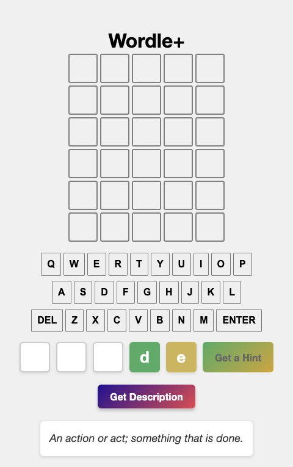

# 🧩 Wordle+

**Wordle+** is an extended version of the popular Wordle game by the New York Times, built with extra features to help the player guess the word more easily.

---

## 🚀 Getting Started

After cloning the repository, you can run the game locally using:

```bash
live-server build

## Make sure you have live-server installed globally. If not, you can install it using:

npm install -g live-server

---

🆕 What's New in Wordle+
Unlike the original Wordle, Wordle+ provides two powerful help features:

🟨🟩 Get Hint
This feature reveals:

One letter in the correct position (🟩).

One letter from the word but in the wrong position (🟨).

📚 Get Description
This feature fetches a one-sentence description of the target word using the Free Dictionary API, giving players a meaningful clue.

📸 Example



In the screenshot above:

The "Get Hint" feature revealed:

d at the correct position (🟩),

e from the word but in the wrong position (🟨).

The "Get Description" feature returned the clue:
“An action or act; something that is done.”

Based on this hint and description, the user correctly guessed the word: "DEEDS" 🎉
```
